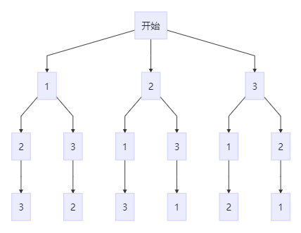

### 题目描述
给定一个没有重复数字的序列，返回其所有可能的全排列。
### 示例
```
输入: [1,2,3]
输出:
[
  [1,2,3],
  [1,3,2],
  [2,1,3],
  [2,3,1],
  [3,1,2],
  [3,2,1]
]
```
### 思路
**回溯法：** 是一种通过探索所有可能的候选解来找出所有的解的算法。如果候选解被确认 不是 一个解的话（或者至少不是最后一个解），回溯算法会通过在上一步进行一些变化抛弃该解，即 回溯 并且再次尝试。
- 通过回溯，生成从第 i 个整数开始的所有全排列。通过递归确定前 i 个数，变换后面的数。

- 避免上面方法的反复交换两个值，通过递归的方式将序列所有的全排列方式分割成树的形式，在用回溯的方法（类似树的先序遍历，但并不是构建出树，而是在构建的过程中就进行了回溯）找出所有的全排列。


### 代码
```JavaScript
/**
 * @param {number[]} nums
 * @return {number[][]}
 */
let permute = function(nums) {
    let resArr = [];
    backtrack(nums.length, resArr, 0, nums);
    return resArr;
};

let backtrack = function(n, resArr, first, nums) {
    if (first === n) resArr.push(nums.slice());
    for (let i = first; i < n; i++) {
        if (first !== i)
            [nums[first], nums[i]] = [nums[i], nums[first]];
        backtrack(n, resArr, first + 1, nums);
        if (first !== i)
            [nums[first], nums[i]] = [nums[i], nums[first]];
    }
}

/**
 * 更优解
 * @param {number[]} nums
 * @return {number[][]}
 */
let permute = function(nums) {
    let l = nums.length;
    if (l === 0) return [];
    if (l === 1) return [nums];
    const resArr = [];
    for (let i = 0; i < l; i++) {
        const subArr = [];
        for (let j = 0; j < l; j++) {
            if (i !== j) {
                subArr.push(nums[j]);
            }
        }
        const subRes = permute(subArr);
        for (let k = 0, kl = subRes.length; k < kl; k++) {
            resArr.push([nums[i]].concat(subRes[k]));
        }
    }
    return resArr;
};
```
